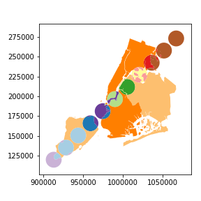

# geopandas-ext
CRS aware overlay operations for geopandas, with significant speed improvements. Also includes additional convenience functions for geoprocessing such as exploding multipart geometries and obtaining spatial units from crs/epsg codes.


[](https://travis-ci.org/austinorr/geopandas-ext)
[](https://codecov.io/gh/austinorr/geopandas-ext)

## Installation
requires:

- `fiona`
- `shapely`
- `geopandas`
- `pyepsg`
- `numpy`
- `pandas`
- `rtree`

### Official releases

...TODO

### Development builds

This is a pure-python package, so building from source is easy on all platforms:

```
git clone https://github.com/austinorr/geopandas-ext.git
cd geopandas-ext
pip install -e .
```

## Quick start

Simply importing `geopandas_ext` lets you use the fast accurate spatial overlay functionality.

```python
import geopandas
from shapely.geometry import Point
from geopandas_ext import spatial_overlay


nybb_filename = geopandas.datasets.get_path('nybb')
polydf = geopandas.read_file(nybb_filename)

N = 10
b = [int(x) for x in polydf.total_bounds]
polydf2 = geopandas.GeoDataFrame(
    [{'geometry': Point(x, y).buffer(10000), 'value1': x + y,
      'value2': x - y}
     for x, y in zip(range(b[0], b[2], int((b[2]-b[0])/N)),
                     range(b[1], b[3], int((b[3]-b[1])/N)))],
    crs=polydf.crs,
    )

uniondf = spatial_overlay(polydf, polydf2, how='union')
_ = uniondf.plot(cmap='Paired')

```




Additional discussion of the new spatial_overlay implementation can be found in this little 


## Testing

Testing is done via the `pytest` module.

`$python check_gpd_ext.py`

or

`$py.test`
